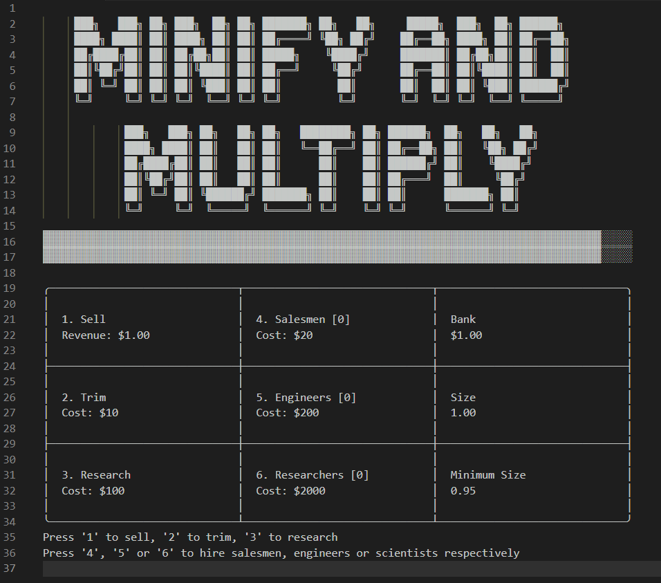
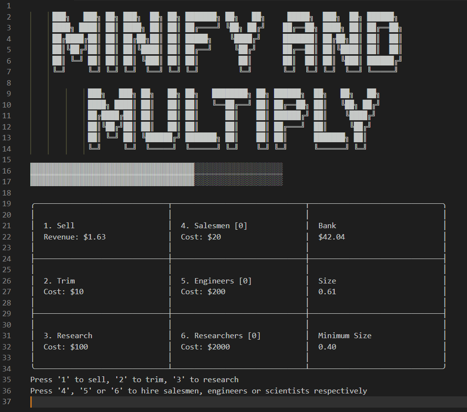

# minify-and-multiply

_Minify and Multiply_ is a cookie clicker game unlike any other! This one can be installed as an extension into the popular IDE **Visual Studio Code** which means you can play it while developing new and exciting software!

### Debugging session not going well? Take a break and manage a business!

## Story

Your factory makes a product. But due to its size, you can only sell a limited number of products per shipment. Well how about you trim its size a little? Awesome, now you can sell more products!

But wait, soon you'll run into the minimum scientific possible size! No worries: why don't you do some science stuff to it? Throw a few testtubes around and _Voila!_ science has made the impossible possible again!

Ugh, I'm tired after all this machining and selling and sciencing, aren't you? Let's hire salesmen, engineers and scientists to do your job for you! They'll help you take this product to `Infinity` and beyond\*!

\*planned feature

## Screenshots

### Game screen

### Minify your product

### Hire employees to automate tasks

### See how low you can go

## Controls

In your Command Palette, use the command `Play Minify and Multiply` to start the game.

Each possible action has a number associated with it, displayed in its box. Press the corresponding numeric key to do that action

| Action           | Number | Description                                                   |
| ---------------- | ------ | ------------------------------------------------------------- |
| Sell             | 1      | Sells as many products as can fit within a 10 m³ container    |
| Trim             | 2      | Reduces the product size by 5% towards the scientific minimum |
| Research         | 3      | Reduces the scientific minimum size by 5%                     |
| Hire [Salesman]  | 4      | Automatatically performs the Sell action\*                    |
| Hire [Engineer]  | 5      | Automatatically performs the Trim action\*                    |
| Hire [Scientist] | 6      | Automatatically performs the Research action\*                |

\*More employees means faster automation

## Known Issues

- Switching away from the game window freezes input. This will be fixed before the first stable release.

## [Release Notes](https://github.com/BURG3R5/minify-and-multiply/releases)
